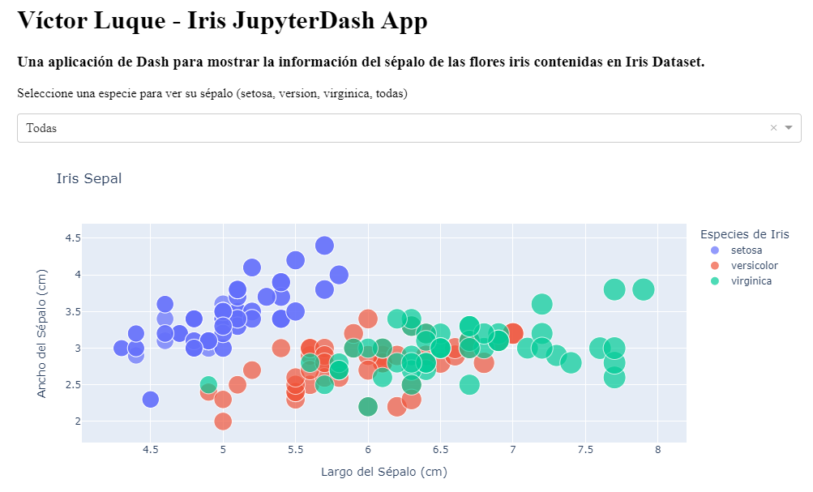
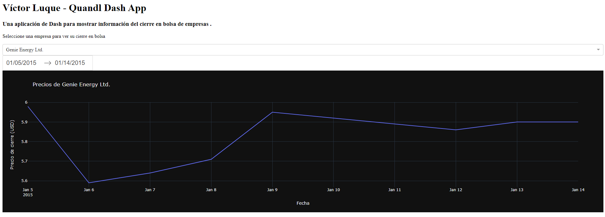

# Dash y JupyterDash
Script creado para la asignatura de Creación de aplicaciones Python de la Escuela Internacional de Postgrados, lección 12.

## Autor
* Nombre: Víctor Luque Martín 
* Fecha: 19-05-2022 
* Versión: 1.0 
* Email: [victorluque341@gmail.com](mailto:victorluque341@gmail.com)

## Comprobación funcionamiento de la aplicación:
1. Activar entorno virtual
2. Instalar dependencias
3. Iniciar aplicación main.py
4. Lanzar Jupyter `jupyter notebook`
5. Iniciar cuaderno de Jupyter `main_nb.ipynb`

## Iris JupyterDash
Esta aplicación ha sido creada con el objetivo de demostrar el uso de Dash y JupyterDash.
Para ello, se han utilizado los datos dentro de Iris Dataset para representar los datos del Sépalo de las especies de Iris.

Además el dashboard permite mostrar los resultados de las tres especies de Iris o los datos de una especie en concreto desde el Dropdown.

Para mostrar este dashboard es necesario ejecutarlo desde `jupyter notebook`.

## Quandl Dash
Esta aplicación ha sido creada con el objetivo de demostrar el uso de Dash y Quandl.
Para ello, se han utilizado los datos de Quandl para representar los datos de los precios del cierre de acciones de diversas empresas conocidas por Quandl.

Los códigos de las empresas se han obtenido desde el csv [WIKI_PRICES](https://static.quandl.com/coverage/WIKI_PRICES.csv)
Adicionalmente, se han cruzado los datos de Quandl con los datos del csv [SECWIKI_TICKERS](https://raw.githubusercontent.com/BangaloreSharks/SharkStock/master/secwiki_tickers.csv) para obtener los nombres de las empresas.

Las funcionalidades que ofrece el dashboard son:
* Mostrar los datos de una empresa en concreto desde el Dropdown
* Mostrar los datos de una empresa en concreto entre dos fechas

Para mostrar este dashboard es necesario ejecutarlo desde la terminal `python main.py`

