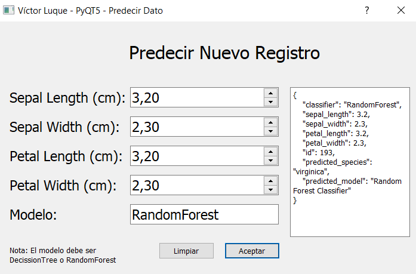

# IRIS PYQT5 GUI
Script creado para la asignatura de Creación de aplicaciones Python de la Escuela Internacional de Postgrados, lección 11.

## Autor
* Nombre: Víctor Luque Martín<br>
* Fecha: 17-05-2022<br>
* Versión: 1.0<br>
* Email: [victorluque341@gmail.com](mailto:victorluque341@gmail.com)

## Dependencias
```powershell
pip install PyQt5
pip install pandas
pip install scikit-learn
```

## Descripción
Este script contiene una aplicación que permite crear una interfaz gráfica con el usuario.
El usuario puede navegar por los distintos menús de la aplicación y seleccionar las opciones que desee para acceder a nuevos apartados.
Los datos de Iris Dataset se encuentran en la ruta `data/iris.csv`.

Para lanzar la aplicación es necesario activar el entorno virtual con `venv/Scripts/activate`, instalar dependencias de forma manual o a través de `pip install requirements.txt` y ejecutar `python main.py`.

## Interfaz gráfica
### Menú principal
Página principal con un menú con las opciones de navegación.


### Mostrar todos los datos de Iris DataSet
Página con una tabla con todos los datos de la base de datos.


### Mostrar el resumen de Iris DataSet
Página con una tabla con el resumen de los datos de la base de datos.


### Precisión de los modelos Machine Learning
Página que muestra la precisión de los modelos Machine Learning.
La precisión se calcula con los datos dentro de Iris Dataset, con un 80% de los datos empleados como entrenamiento y un 20% como prueba (train y test).
Los resultados varían en función de la predicción de los modelos.


### Insertar Datos
Página con un formulario para insertar datos en la base de datos.


### Predecir e Insertar datos
Página con un formulario para insertar datos en la base de datos y una tabla con los resultados de la predicción.


### Actualizar último dato
Página con un formulario para actualizar el último dato de la base de datos.


### Actualizar dato por ID
Página con un formulario para actualizar un dato de la base de datos por su ID.


### Eliminar
Página con un formulario para eliminar el último dato de la base de datos o un registro en base a un ID dado por el usuario desde el campo ID.

