# PyWebIO
Script creado para la asignatura de Creación de aplicaciones Python de la Escuela Internacional de Postgrados, lección 14.

## Autor
* Nombre: Víctor Luque Martín 
* Fecha: 25-05-2022 
* Versión: 1.0 
* Email: [victorluque341@gmail.com](mailto:victorluque341@gmail.com)

## Comprobación funcionamiento de la aplicación:
1. Activar entorno virtual
2. Instalar dependencias `pip install -r requirements.txt`
3. Iniciar aplicación `python main.py`
4. Acceder desde el navegador a `localhost:8080`

## Interfáz Web
### Home
Muestra las diferentes aplicaciones del proyecto `Víctor Luque Martín - Iris PyWebIO` y un menú de navegación para acceder cada una de las aplicaciones.

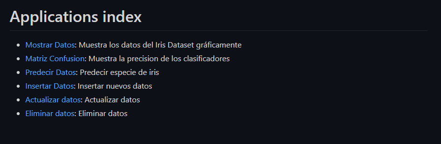

### Ver Datos
Muestra información relativa a los datos de Iris Dataset.
Se divide en dos secciones principales:
* Sección 1: Datos de Iris Dataset (tabla)
* Sección 2: Gráficas del resumen de los datos (conteo, max, min, media, desviación estándar, etc.)

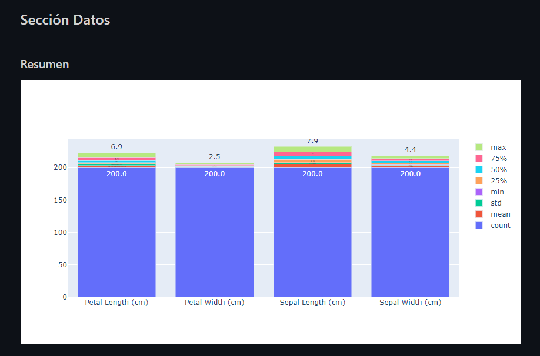
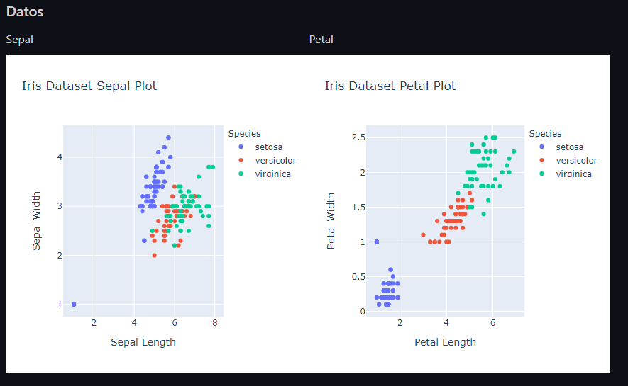

### Machine Learning
Muestra la precisión de los modelos de clasificación (Decision Tree, Random Forest) y visualización de los resultados en una matriz de confusión.

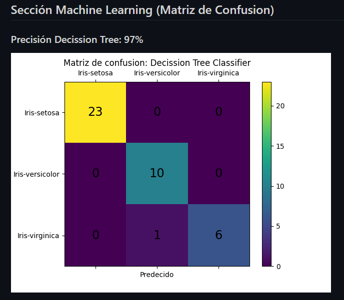
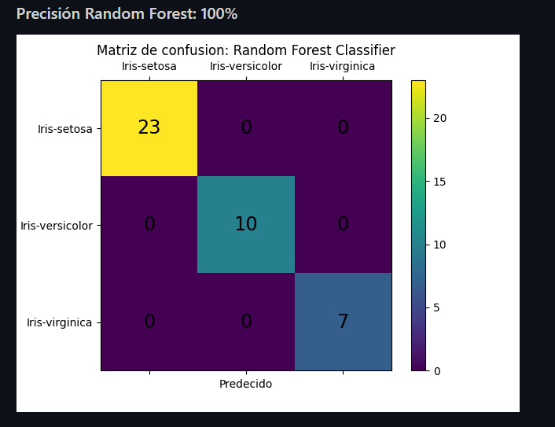

### Predecir
Muestra un formulario para predecir e introducir los datos de una nueva fila de Iris Dataset.

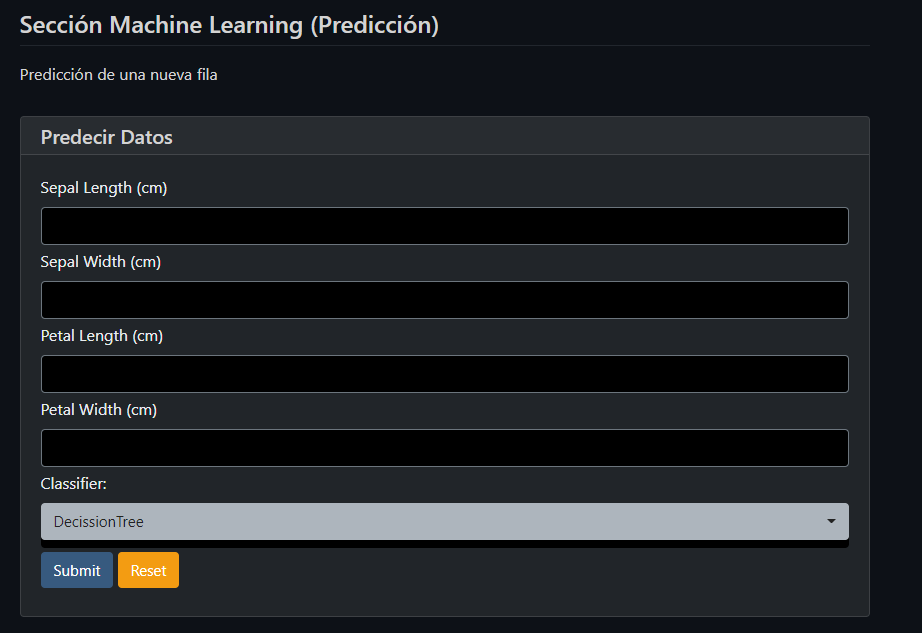
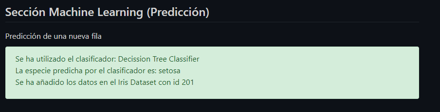

### Insertar
Muestra un formulario para introducir los datos de una nueva fila de Iris Dataset.

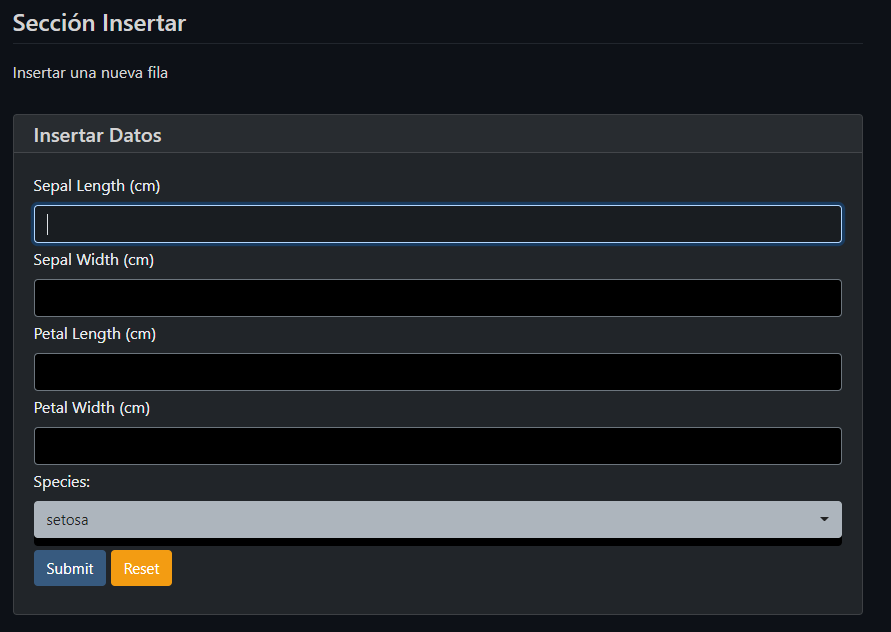
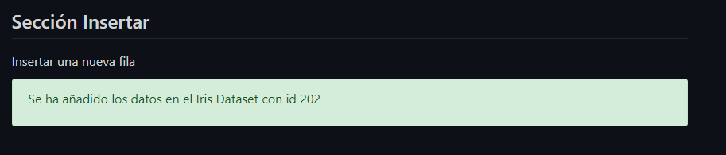

### Actualizar
Muestra un formulario para actualizar los datos de una fila de Iris Dataset.

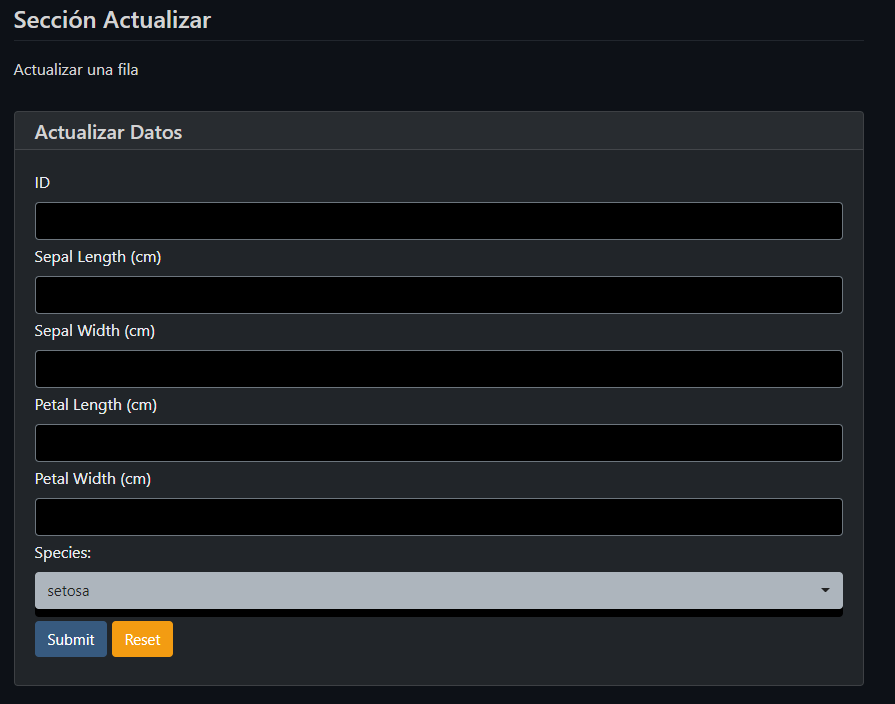
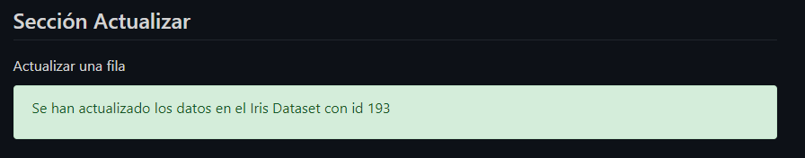

### Eliminar
Muestra un formulario para eliminar una fila de Iris Dataset.

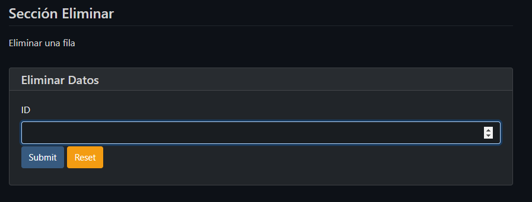
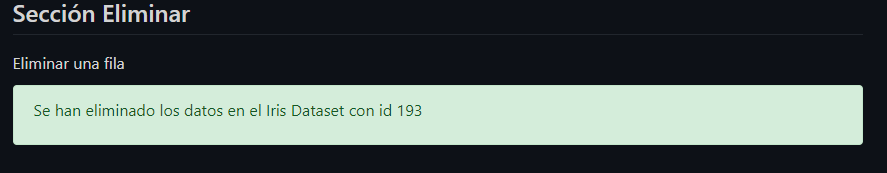
