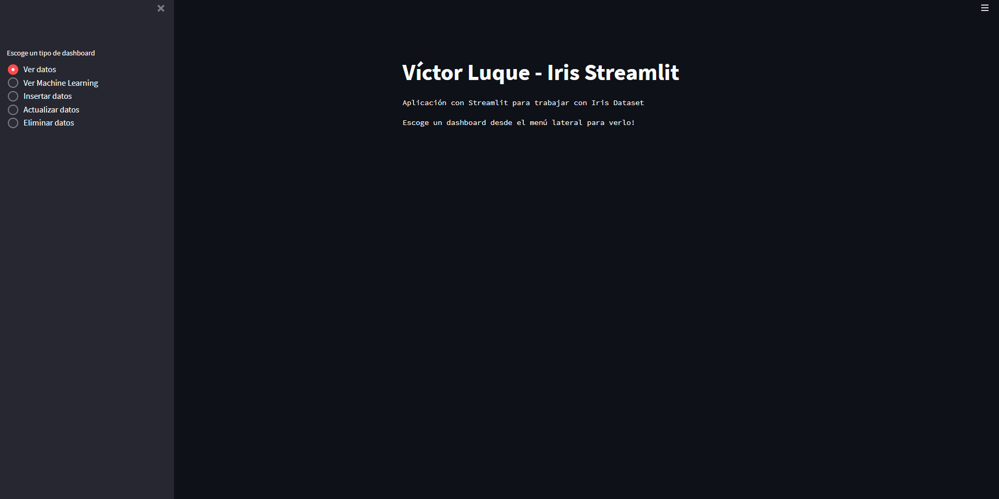
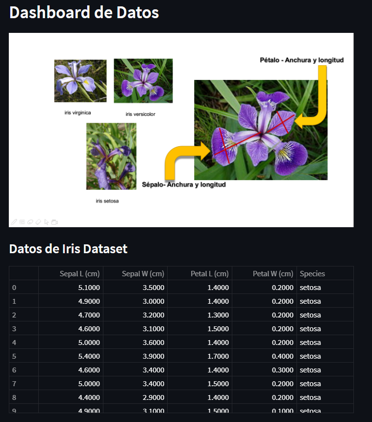
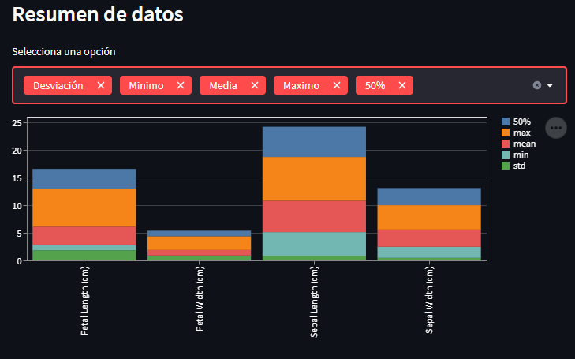
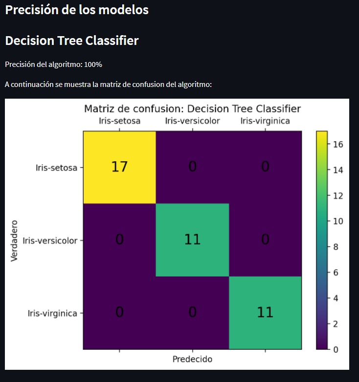
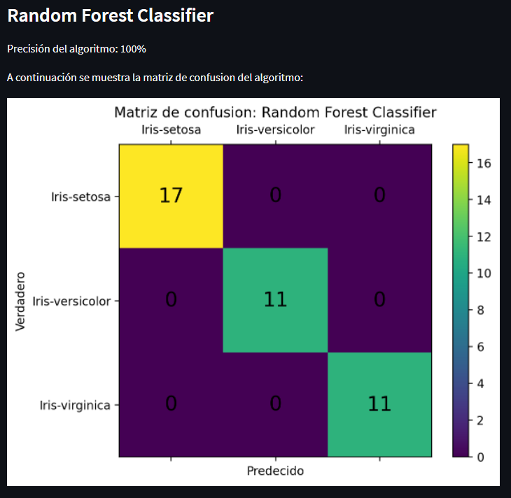
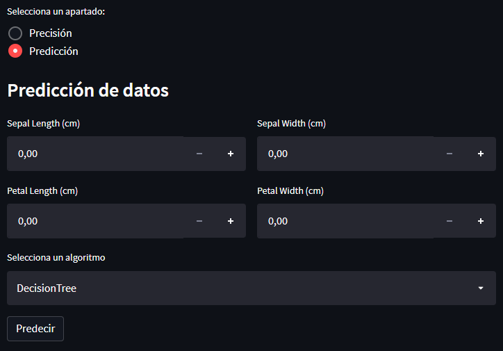
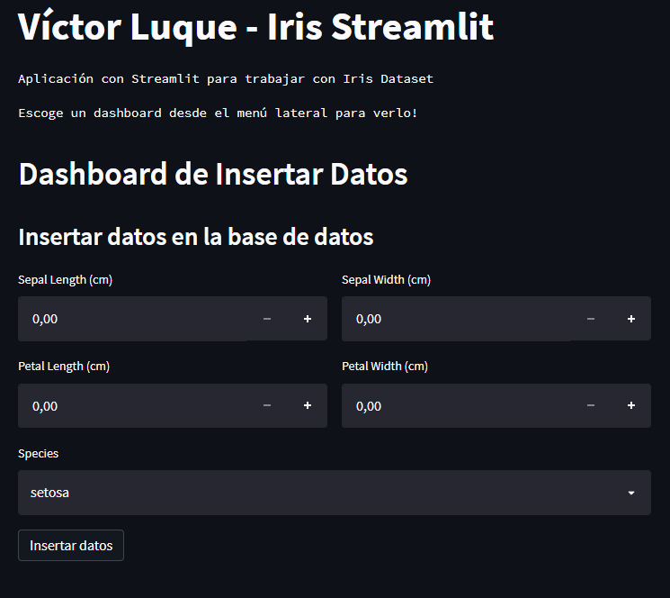
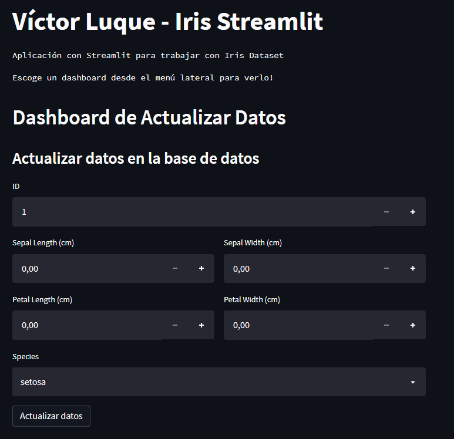
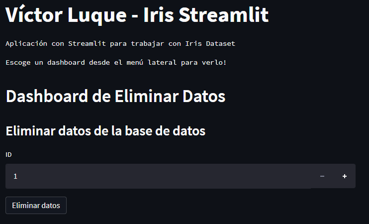

# Streamlit
Script creado para la asignatura de Creación de aplicaciones Python de la Escuela Internacional de Postgrados, lección 13.

## Autor
* Nombre: Víctor Luque Martín 
* Fecha: 24-05-2022 
* Versión: 1.0 
* Email: [victorluque341@gmail.com](mailto:victorluque341@gmail.com)

## Comprobación funcionamiento de la aplicación:
1. Activar entorno virtual
2. Instalar dependencias
3. Iniciar aplicación `streamlit run main.py`

## Interfáz Web
### Genérica
Muestra el título del proyecto `Víctor Luque Martín - Iris Streamlit` y un menú de navegación lateral para acceder a las diferentes páginas.

### Ver Datos
Muestra información relativa a los datos de Iris Dataset.
Se divide en dos secciones principales:
* Sección 1: Datos de Iris Dataset (tabla)
* Sección 2: Gráficas del resumen de los datos (conteo, max, min, media, desviación estándar, etc.)

### Machine Learning
Muestra información relativa a Machine Learning aplicada a Iris Dataset.
Se divide en dos secciones principales:
* Sección 1: Precisión de los modelos de clasificación (Decision Tree, Random Forest) y visualización de los resultados en una matriz de confusión
* Sección 2: Predicción de datos nuevos en función del clasificador (Decision Tree, Random Forest)

### Insertar
Muestra un formulario para introducir los datos de una nueva fila de Iris Dataset.

### Actualizar
Muestra un formulario para actualizar los datos de una fila de Iris Dataset.

### Eliminar
Muestra un formulario para eliminar una fila de Iris Dataset.

